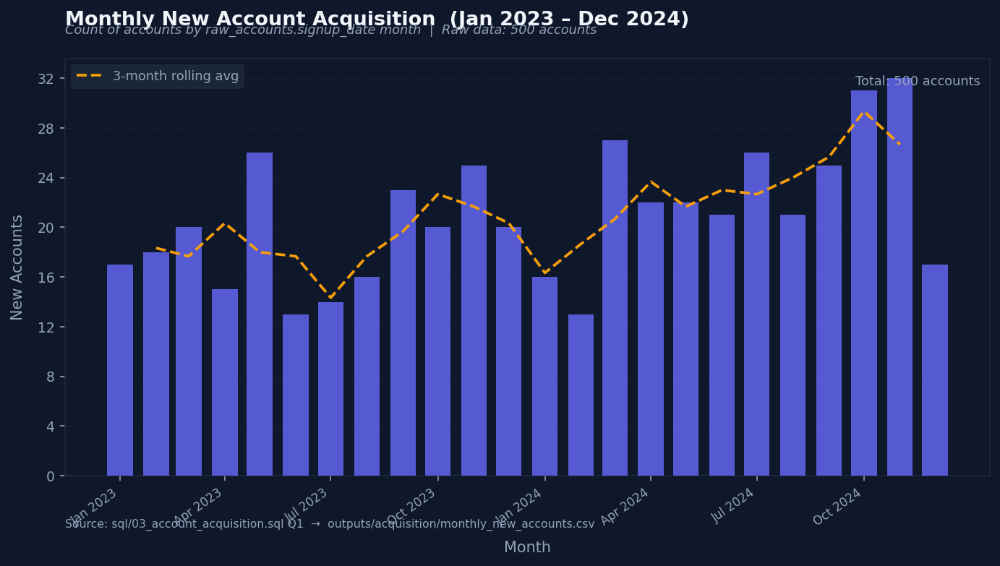
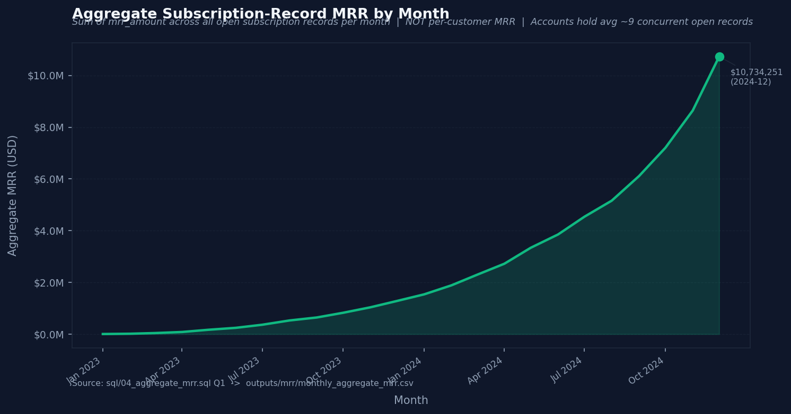
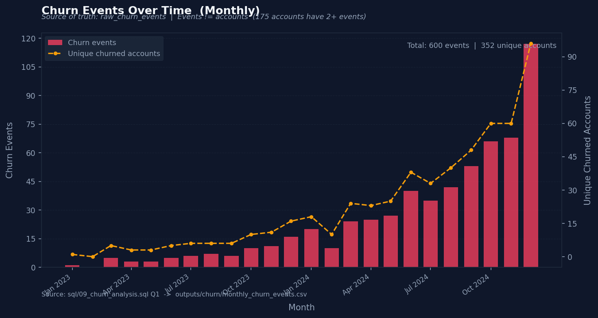
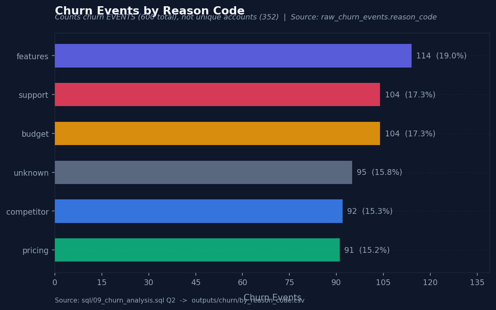
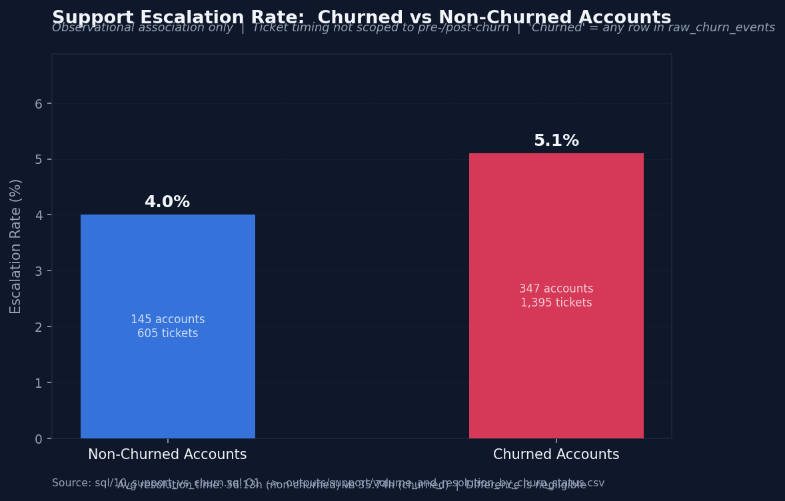

# RavenStack Customer Lifecycle & Retention Analytics

SQL-first SaaS analytics on a synthetic five-table dataset — built to demonstrate
relational data modelling, data-quality auditing, and defensible metric design.

> **Dataset:** Synthetic RavenStack SaaS &nbsp;|&nbsp; **Engine:** PostgreSQL &nbsp;|&nbsp; **Period:** Jan 2023 – Dec 2024

---

## Why this project?

Most analytics portfolios apply standard transformations to clean data. This one starts
by auditing whether the data supports the metrics it appears to support — and adjusts
the analysis when it does not.

Three data problems discovered during the audit materially changed what was computed:

| # | Problem | Impact |
|---|---|---|
| 1 | Accounts hold **5–14 concurrently open subscription records** (avg ~9), with no sequential plan history | No "current plan per account" or conventional customer MRR can be cleanly computed |
| 2 | `accounts.churn_flag` **conflicts with `churn_events`** for ~62% of accounts | All churn metrics use `raw_churn_events` as the sole source of truth; `accounts.churn_flag` is retired |
| 3 | Only **~22% of feature-usage rows** fall inside their linked subscription's active date window | Subscription-scoped feature engagement is not claimed; analysis uses account-level aggregates instead |

These are part of the analytical story. Full documentation in [`docs/data_audit.md`](docs/data_audit.md).

---

## SQL Techniques Demonstrated

| Technique | Where used |
|---|---|
| CTEs (multi-level) | All analytical files; 06, 07 use 5–6 CTE layers |
| Window functions (`RANK`, `PERCENTILE_CONT`, `SUM OVER`) | 03, 04, 07, 08, 09 |
| `DATE_TRUNC` / date arithmetic / interval logic | 02, 03, 04, 06, 07, 09 |
| Conditional aggregation (`FILTER (WHERE ...)`) | 03, 04, 05, 08, 09, 10 |
| Calendar spine via `generate_series` | 02 (shared infrastructure view) |
| Cohort logic (cohort × months-since-signup matrix) | 06, 07 |
| Right-censoring bias correction (eligible-cohort denominator) | 06 Q2 |
| Dual-denominator reporting (events vs unique accounts) | 09, 10 |
| Cross-file reconciliation / validation blocks | All files; 11 is a dedicated summary + validation |
| `BOOL_OR`, `EXISTS` subqueries | 05 |

---

## Business Questions Covered

Eight analyses, each in a dedicated SQL file:

1. **Account acquisition** — monthly trend, referral source, plan tier, industry, country
2. **Aggregate Subscription-Record MRR** — monthly trend, plan-tier split, trial/paid record mix
3. **Trial-to-paid conversion** — subscription-level proxy and account-level rate reported separately
4. **Cohort retention** — full matrix + pooled curve with right-censoring correction
5. **Cohort observed value** — cumulative subscription-record MRR by cohort and months-since-signup
6. **Feature engagement** — usage volume, error rates, beta vs GA, churned vs non-churned accounts
7. **Churn analysis** — monthly events, reason codes, plan tier, time-to-first-churn, repeat churn, refunds
8. **Support vs churn** — ticket volume, resolution time, escalation rate, priority mix by churn status

---

## Key Findings

### 1. Churn events vs unique churned accounts

600 total churn events across 352 unique accounts — 175 accounts have two or more
churn events, implying churn/reactivation cycles. Quoting one number without the other
misrepresents the churn picture.

> **What the data shows:** 352 of 500 accounts recorded at least one churn event (70.4% prevalence).  
> **What it suggests:** Churn is widespread, but many accounts re-engaged after churning.  
> **Caveat:** 70.4% is a prevalence figure, not an event-based rate. `raw_accounts.churn_flag` cannot
> be used for this calculation — it conflicts with `raw_churn_events` for ~62% of accounts.

---

### 2. Trial-to-paid conversion is ambiguous at account level

At the subscription level: 690 of 778 trial records (88.7%) are associated with a
later paid record on the same account. At the account level: effectively 100% of accounts
with any trial record also have a paid record.

> **What the data shows:** Both rates are calculable and both are accurate.  
> **What it suggests:** The data does not support isolating a clean trial→paid causal funnel.  
> **Caveat:** Because accounts hold many concurrent subscriptions, a trial record and a paid
> record can coexist without one causing the other. The 88.7% is a proxy, labeled as such
> throughout. See [`sql/05_trial_conversion.sql`](sql/05_trial_conversion.sql).

---

### 3. The retention curve is a data-model artifact — and was diagnosed as one

The pooled 6-month observed account subscription retention is 98.9%. This is not a meaningful
attrition signal: ~90% of subscription records never receive an `end_date`, so once an account
has any open record it continues to register as "active" under this definition indefinitely.

> **What the data shows:** The retention curve rises from ~44% at month 0 to ~99% by month 6
> before plateauing — an unusual shape for a retention curve.  
> **What it suggests:** The month-0 dip and early rise reflect the gap between `signup_date`
> and the first subscription `start_date` (up to ~430 days for some accounts), not attrition.  
> **Caveat:** Reported as "Observed Account Subscription Retention" under a documented structural
> definition. Never used as evidence of real customer attrition. See [`sql/06_cohort_retention.sql`](sql/06_cohort_retention.sql).

---

### 4. Aggregate Subscription-Record MRR requires deliberate naming

The December 2024 aggregate MRR figure is $10,734,251. The correct interpretation:
the sum of `mrr_amount` across all open subscription records in that month.

> **What the data shows:** A rising aggregate trend from Jan 2023 to Dec 2024.  
> **What it suggests:** Revenue-bearing subscription records are accumulating over time.  
> **Caveat:** This figure double-, triple-, or N-times-counts revenue for any account
> holding multiple concurrent open records. It is not equivalent to contracted ARR,
> per-customer MRR, or net-revenue-retention. The name "Aggregate Subscription-Record MRR"
> is used throughout to enforce this distinction.

---

### 5. Support activity produced a genuine null result — and that is worth reporting

Churned accounts show a slightly higher escalation rate (5.1% vs 4.0%) and marginally
shorter average resolution time (35.74h vs 36.13h non-churned).

> **What the data shows:** The support behavior difference between churned and non-churned
> accounts is very small.  
> **What it suggests:** Support volume or quality does not strongly differentiate churned
> accounts in this dataset.  
> **Caveat:** This is an observational association only. Ticket timing is not scoped to
> before the churn event — whole-account-lifetime tickets are included. No causal claim is
> made. A null result here is an honest result; reporting it plainly is the point.

---

## Visuals

All charts generated by [`python/generate_charts.py`](python/generate_charts.py)
from `outputs/` CSV files. SQL is the analytical engine; Python is presentation only.

**Monthly New Account Acquisition (Jan 2023 – Dec 2024)**  
500 accounts across 24 months; dashed line is 3-month rolling average.



---

**Aggregate Subscription-Record MRR by Month**  
Sum of `mrr_amount` across all open subscription records — not per-customer MRR.



---

**Churn Events Over Time (Monthly)**  
Primary bars: total churn events. Secondary line: unique churned accounts.  
Events exceed accounts because 175 accounts have 2+ churn events.



---

**Churn Events by Reason Code**  
Top reasons: feature gaps (19.0%), budget constraints (17.3%), support issues (17.3%).



---

**Support Escalation Rate: Churned vs Non-Churned Accounts (Observational)**  
Difference is modest (5.1% vs 4.0%); resolution time difference is negligible.



---

## Data Quality Summary

16 checks documented in [`docs/data_audit.md`](docs/data_audit.md).
Most consequential findings:

| Issue | Impact on analysis |
|---|---|
| Concurrent open subscriptions (avg ~9 per account) | No per-customer MRR, no "current plan" — aggregate subscription-record metrics used instead |
| `accounts.churn_flag` conflicts with `churn_events` | `raw_churn_events` is the authoritative churn source of truth throughout |
| ~78% of feature-usage rows fall outside their subscription's date window | Feature engagement analyzed at account/global level only |
| `usage_id` has 21 duplicate values in `raw_feature_usage` | Not declared as primary key; deduplication on `usage_id` is not safe without additional logic |
| `satisfaction_score` is NULL for ~41% of tickets; observed range 3.0–5.0 only | Selection bias documented; score never treated as representative |
| `signup_date` and first subscription `start_date` are not tightly coupled | Retention month-0 figure (~44%) reflects onboarding ramp, not attrition |

Entity-relationship diagram and table grain documentation: [`docs/erd.md`](docs/erd.md)

---

## Pipeline

```
data/raw/  (5 CSVs, unmodified)
    └─→  sql/00_load_raw_data.sql       DDL + \copy load, no transformation
         sql/01_data_quality_checks.sql  16 diagnostic queries, no mutations
         sql/02_calendar_spine.sql       Shared infrastructure view
         sql/03–10_*.sql                 Analyses (acquisition, MRR, conversion,
                                          retention, observed value, engagement,
                                          churn, support)
         sql/11_business_summary.sql     Cross-analysis summary + validation
              └─→  outputs/             Reproducible CSV outputs per analysis
                   python/generate_charts.py
                        └─→  charts/   5 static PNG charts
```

---

## SQL File Index

| File | Analysis |
|---|---|
| [`00_load_raw_data.sql`](sql/00_load_raw_data.sql) | DDL for five raw tables; `\copy` load |
| [`01_data_quality_checks.sql`](sql/01_data_quality_checks.sql) | 16 diagnostic checks — row counts, PK uniqueness, FK integrity, NULL rates, temporal alignment, date sanity |
| [`02_calendar_spine.sql`](sql/02_calendar_spine.sql) | `calendar_month_spine` view via `generate_series` |
| [`03_account_acquisition.sql`](sql/03_account_acquisition.sql) | Monthly trend, referral source, plan tier, industry, country |
| [`04_aggregate_mrr.sql`](sql/04_aggregate_mrr.sql) | Monthly Aggregate Subscription-Record MRR, plan-tier split |
| [`05_trial_conversion.sql`](sql/05_trial_conversion.sql) | Sub-level proxy + account-level conversion; dual-denominator design |
| [`06_cohort_retention.sql`](sql/06_cohort_retention.sql) | Cohort matrix + pooled curve with right-censoring correction |
| [`07_cohort_observed_value.sql`](sql/07_cohort_observed_value.sql) | Cumulative observed subscription MRR by cohort |
| [`08_feature_engagement.sql`](sql/08_feature_engagement.sql) | Usage volume, error rates, churned vs non-churned accounts |
| [`09_churn_analysis.sql`](sql/09_churn_analysis.sql) | Monthly events, reason codes, plan tier, repeat churn, refunds |
| [`10_support_vs_churn.sql`](sql/10_support_vs_churn.sql) | Ticket volume, resolution time, escalation rate by churn status |
| [`11_business_summary.sql`](sql/11_business_summary.sql) | Summary table + three cross-file validation checks |

---

## Reproduction

### Prerequisites
- PostgreSQL (tested on 14+)
- Python 3.8+ with `pandas` and `matplotlib` (for CSV outputs and charts only)

### 1 — Load raw data

```bash
createdb ravenstack
psql -h localhost -U postgres -d ravenstack -f sql/00_load_raw_data.sql
psql -h localhost -U postgres -d ravenstack -f sql/02_calendar_spine.sql
```

`00_load_raw_data.sql` creates five raw tables and loads the CSVs via `\copy`.
Run from the repository root so the relative `data/raw/` paths resolve.

### 2 — Run data quality checks

```bash
psql -h localhost -U postgres -d ravenstack -f sql/01_data_quality_checks.sql
```

Produces 16 diagnostic result sets. No data is modified.

### 3 — Run analyses

```bash
psql -h localhost -U postgres -d ravenstack -f sql/03_account_acquisition.sql
psql -h localhost -U postgres -d ravenstack -f sql/04_aggregate_mrr.sql
psql -h localhost -U postgres -d ravenstack -f sql/05_trial_conversion.sql
psql -h localhost -U postgres -d ravenstack -f sql/06_cohort_retention.sql
psql -h localhost -U postgres -d ravenstack -f sql/07_cohort_observed_value.sql
psql -h localhost -U postgres -d ravenstack -f sql/08_feature_engagement.sql
psql -h localhost -U postgres -d ravenstack -f sql/09_churn_analysis.sql
psql -h localhost -U postgres -d ravenstack -f sql/10_support_vs_churn.sql
psql -h localhost -U postgres -d ravenstack -f sql/11_business_summary.sql
```

### 4 — Generate output CSVs

If you have a live PostgreSQL connection, pipe query output to CSV directly.
Alternatively, the Python helper replicates the same SQL logic mechanically:

```bash
python python/generate_outputs.py
```

This writes 18 CSV files to `outputs/`. It does not add new analysis.

### 5 — Generate charts

```bash
python python/generate_charts.py
```

Reads only from `outputs/`. Writes 5 PNGs to `charts/`.

---

## Repository Structure

```
ravenstack-saas-analytics/
├── sql/                    PostgreSQL SQL files (00–11); the analytical engine
├── data/raw/               Five source CSVs, unmodified
├── outputs/                Reproducible CSV outputs, one subdirectory per analysis
│   ├── acquisition/
│   ├── mrr/
│   ├── conversion/
│   ├── retention/
│   ├── observed_value/
│   ├── engagement/
│   ├── churn/
│   └── support/
├── charts/                 Static PNG charts generated from outputs/
├── python/                 Output and chart generation scripts (presentation only)
│   ├── generate_outputs.py
│   └── generate_charts.py
└── docs/                   Project documentation
    ├── project_spec.md     Dataset description, stack, SQL index, run instructions
    ├── data_audit.md       All 16 data quality checks with findings and implications
    ├── erd.md              Mermaid ER diagram and table grain documentation
    ├── results_review.md   Validated metrics with definitions and caveats
    └── chart_notes.md      Per-chart source SQL, output, definition, caveat
```

---

## Dataset

Synthetic RavenStack SaaS dataset — fictional company, fictional data.

| Table | Rows | Grain |
|---|---|---|
| `raw_accounts` | 500 | One account |
| `raw_subscriptions` | 5 000 | One subscription record |
| `raw_feature_usage` | 25 000 | One usage event |
| `raw_support_tickets` | 2 000 | One support ticket |
| `raw_churn_events` | 600 | One churn event |

Source: [Kaggle — RavenStack SaaS Customer Analytics Dataset](https://www.kaggle.com/)  
License: MIT

---

## Limitations

- **Synthetic data.** All companies, accounts, and transactions are fictional. Findings describe the dataset, not real SaaS business behavior.
- **Concurrent subscriptions.** The subscription data does not permit computing per-customer MRR, net revenue retention, or a clean "current plan" per account.
- **Churn flag inconsistency.** `raw_accounts.churn_flag` is not usable as a churn signal. All churn analysis uses `raw_churn_events`.
- **Feature usage temporal mismatch.** Subscription-scoped feature engagement cannot be reliably computed; account-level aggregates are used instead.
- **Retention ceiling effect.** The 98.9% pooled 6-month retention figure is structurally biased toward a ceiling by the ~90% NULL `end_date` rate. It is not a sensitive attrition signal.
- **Observational analysis only.** No comparison in this project — including support vs churn — establishes a causal relationship.
- **Satisfaction score bias.** `satisfaction_score` is missing for ~41% of tickets and never falls below 3.0 where present. It is not analyzed as a representative metric.
- **Aggregate MRR overcounting.** The $10,734,251 December 2024 MRR figure sums across all concurrent open subscription records per account. It is not a contracted revenue figure.

---

## What This Project Demonstrates

The ability to audit relational business data, recognise when a metric is technically
calculable but analytically misleading, build validated SQL analyses around imperfect
data, and communicate findings with appropriate caveats.

Specifically: recognising that subscription density makes customer-MRR computation
unreliable, that `churn_flag` inconsistency requires a different source of truth, and
that a 99% retention rate is better explained by a structural data constraint than by
genuine customer loyalty — and building the project around those facts rather than
around the headline numbers.
