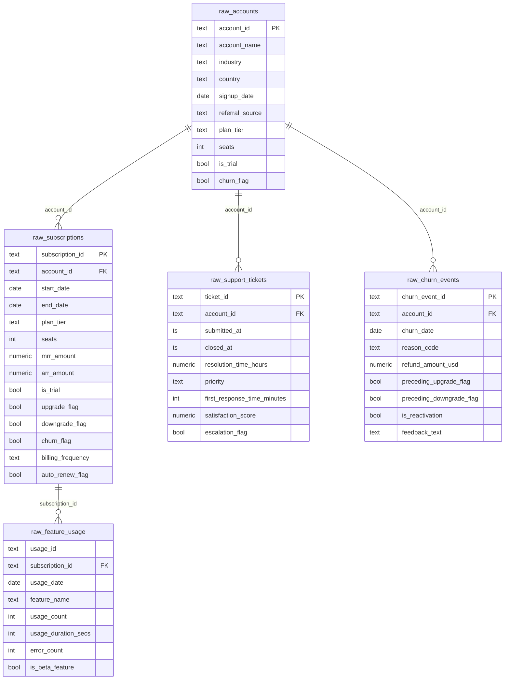

# RavenStack — Entity Relationship Diagram

## Mermaid ER Diagram

---

## Table Descriptions

### `raw_accounts`
**Grain:** one row per account. `account_id` is unique (verified in data quality
check 2).

**Important caveats:**
- `plan_tier` is a **static current-state label**, not a historical record of
  which plan the account held at signup or at any prior point in time.
- `churn_flag` **is not the churn source of truth**. It conflicts substantially
  with `raw_churn_events` presence (data quality check 9). All downstream churn
  metrics use `raw_churn_events` exclusively.
- `is_trial` at the account level is a snapshot field; subscription-level
  `is_trial` in `raw_subscriptions` is used for conversion analysis.

---

### `raw_subscriptions`
**Grain:** one row per subscription record. `subscription_id` is unique.

**Important caveats:**
- Accounts routinely hold **5–14 concurrently open** subscription records
  (data quality check 5). This is the single most important structural
  constraint in the dataset — it rules out computing "current plan per account"
  or conventional net-MRR-retention metrics.
- `end_date IS NULL` for ~90% of rows. NULL means the record has not been
  closed; it does **not** mean the date is unknown or missing. Never backfill or
  impute `end_date`.
- `arr_amount` is always `mrr_amount * 12` (verified in check 7). It carries no
  independent signal.
- `churn_flag` at the subscription level is consistent with `end_date IS NOT
  NULL`, but `raw_accounts.churn_flag` is not consistent with `raw_churn_events`
  — they are different things.

---

### `raw_feature_usage`
**Grain:** intended as one row per usage event; `usage_id` has 21 duplicate
values (data quality check 3), so it is not declared as a primary key.

**Important caveats:**
- Only **~22%** of usage rows fall inside their linked subscription's active
  date window (data quality check 11). The FK to `raw_subscriptions` is used
  solely as a bridge to recover `account_id` — temporal subscription-period
  scoping is not applied to feature usage anywhere in this project.
- The 21 duplicate `usage_id` rows are retained in the raw table; deduplication
  on `usage_id` is not performed because the duplicate rows may represent
  distinct usage events that were assigned the same id by the upstream system.

---

### `raw_support_tickets`
**Grain:** one row per ticket. `ticket_id` is unique.

**Important caveats:**
- `satisfaction_score` is NULL for **~41%** of tickets (data quality check 12).
  Where present it only falls in [3.0, 5.0], indicating selection bias
  (dissatisfied customers likely under-report). This field is never treated as
  representative of all tickets.

---

### `raw_churn_events`
**Grain:** one row per churn event. `churn_event_id` is unique.

**Important caveats:**
- An account can have **multiple churn events** (600 events across 352 unique
  accounts; 175 accounts have 2+ events). Every downstream metric explicitly
  distinguishes "churn events" from "unique churned accounts".
- `is_reactivation` flags events where the account had previously churned and
  came back. 61 such events exist in the dataset.
- `feedback_text` is NULL for ~25% of rows.
- This table is the **authoritative churn source of truth** for the entire
  project.

---

## Foreign Key Summary

| Relationship | Cardinality | Notes |
|---|---|---|
| `raw_subscriptions.account_id → raw_accounts.account_id` | Many-to-one | 5–14 subscription records per account |
| `raw_feature_usage.subscription_id → raw_subscriptions.subscription_id` | Many-to-one | Temporal alignment unreliable (~22% in-window) |
| `raw_support_tickets.account_id → raw_accounts.account_id` | Many-to-one | 0–n tickets per account |
| `raw_churn_events.account_id → raw_accounts.account_id` | Many-to-one | 0–n events per account; 352 of 500 accounts have ≥1 |

All FK relationships have zero orphan rows (verified in data quality check 4).
